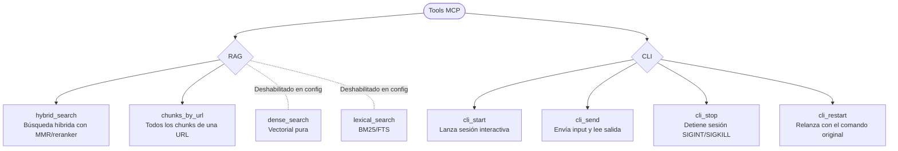

# Resumen visual de tools MCP

## Notas rápidas
- `hybrid_search`: mezcla denso+léxico, normaliza, aplica MMR y reranker si está activo.
- `chunks_by_url`: devuelve todos los chunks y metadatos de una URL.
- `dense_search` / `lexical_search`: están presentes pero deshabilitados en `config.yaml` (actívalos con `mcp.tools` o sets).
- `cli_start`/`cli_send`/`cli_stop`/`cli_restart`: control de CLIs de texto; soportan `conda_env`, `workdir`, `timeout` y devuelven `status_hint`/`next_step`. Logs en disco controlados por `mcp.cli_logs_enabled`.
