# Resumen visual de tools MCP

```mermaid
flowchart TD
    root([Tools MCP])
    rag{RAG}
    python_cli{Python CLI}
    items{Items}

    root --> rag
    root --> python_cli
    root --> items

    rag --> hybrid[hybrid_search<br/>Búsqueda híbrida con MMR/reranker]
    rag --> chunks[chunks_by_url<br/>Todos los chunks de una URL]
    rag -.-|Deshabilitado en config| dense[dense_search<br/>Vectorial pura]
    rag -.-|Deshabilitado en config| lexical[lexical_search<br/>BM25/FTS]

    python_cli --> start[python_cli_start<br/>Python script/module]
    python_cli --> send[python_cli_send<br/>Send input + read]
    python_cli --> stop[python_cli_stop<br/>SIGINT/SIGTERM/SIGKILL]
    python_cli --> restart[python_cli_restart<br/>Restart with same config]
    python_cli --> call[python_call_function<br/>Function call in subprocess]

    items --> store[store_item<br/>Crea memory/doc/bug/todo]
    items --> update[update_item<br/>Actualiza metadatos]
    items --> get[get_item<br/>Recupera un item por id]
    items --> list[list_items<br/>Filtra por tipo/estado/tags]
    items --> search[search_items<br/>Búsqueda por texto/meta]
    items --> patch[patch_doc<br/>Diff sobre body_md de docs]
    items --> del[delete_item<br/>Elimina un item]
```

## Notas rápidas
- `hybrid_search`: mezcla denso+léxico, normaliza, aplica MMR y reranker si está activo.
- `chunks_by_url`: devuelve todos los chunks y metadatos de una URL.
- `dense_search` / `lexical_search`: están presentes pero deshabilitados en `config.yaml` (actívalos con `mcp.tools` o sets).
- Ámbito: el índice RAG es global (no por proyecto); las tools de Items operan por proyecto.
- `python_cli_start`/`python_cli_send`/`python_cli_stop`/`python_cli_restart`: sesiones interactivas de Python (script o módulo); aceptan `conda_env`, `workdir`, `timeout`, y devuelven `status_hint`/`next_step`. `max_bytes` opcional limita el delta de salida por lectura (por defecto 16000). No ejecuta shell general.
- `python_call_function`: llamada no interactiva a funciones de `utils.*`/`scripts.*` en subproceso con payload JSON y respuesta estructurada `ok/result/stdout/stderr/error_*`.
- `store_item`/`update_item`/`get_item`/`list_items`/`search_items`/`patch_doc`/`delete_item`: gestión de items por proyecto (`project` o `project_id`). `typed` recoge campos obligatorios por tipo; `meta` es opcional para extras. `patch_doc` edita docs por diff unificado.

## Novedades UI relacionadas
- Dashboard → Status: agrupa las tools activas por grupo y muestra contadores de Memory para el proyecto activo.
- Dashboard → Integrations: snippets listos para Codex CLI, Claude Code y GitHub Copilot (VS Code).
