# Resumen visual de tools MCP

```mermaid
flowchart TD
    root([Tools MCP])
    rag{RAG}
    cli{CLI}
    items{Items}

    root --> rag
    root --> cli
    root --> items

    rag --> hybrid[hybrid_search<br/>Búsqueda híbrida con MMR/reranker]
    rag --> chunks[chunks_by_url<br/>Todos los chunks de una URL]
    rag -.-|Deshabilitado en config| dense[dense_search<br/>Vectorial pura]
    rag -.-|Deshabilitado en config| lexical[lexical_search<br/>BM25/FTS]

    cli --> start[cli_start<br/>Lanza sesión interactiva]
    cli --> send[cli_send<br/>Envía input y lee salida]
    cli --> stop[cli_stop<br/>Detiene sesión SIGINT/SIGKILL]
    cli --> restart[cli_restart<br/>Relanza con el comando original]

    items --> store[store_item<br/>Crea memory/doc/bug/todo]
    items --> update[update_item<br/>Actualiza metadatos]
    items --> get[get_item<br/>Recupera un item por id]
    items --> list[list_items<br/>Filtra por tipo/estado/tags]
    items --> search[search_items<br/>Búsqueda por texto/meta]
    items --> patch[patch_doc<br/>Diff sobre body_md de docs]
    items --> del[delete_item<br/>Elimina un item]
```

## Notas rápidas
- `hybrid_search`: mezcla denso+léxico, normaliza, aplica MMR y reranker si está activo.
- `chunks_by_url`: devuelve todos los chunks y metadatos de una URL.
- `dense_search` / `lexical_search`: están presentes pero deshabilitados en `config.yaml` (actívalos con `mcp.tools` o sets).
- Ámbito: el índice RAG es global (no por proyecto); las tools de Items operan por proyecto.
- `cli_start`/`cli_send`/`cli_stop`/`cli_restart`: control de CLIs de texto; soportan `conda_env`, `workdir`, `timeout` y devuelven `status_hint`/`next_step`. Logs en disco controlados por `mcp.cli_logs_enabled`.
 - `cli_start`/`cli_send`/`cli_stop`/`cli_restart`: control de CLIs de texto; soportan `conda_env`, `workdir`, `timeout` y devuelven `status_hint`/`next_step`. Logs en disco controlados por `mcp.cli_logs_enabled`.
   - Parámetros nuevos: `max_bytes` opcional en `cli_start` y `cli_send` para limitar los bytes de salida devueltos por llamada (delta desde el último pull). Por defecto 16000.
- `store_item`/`update_item`/`get_item`/`list_items`/`search_items`/`patch_doc`/`delete_item`: gestión de items por proyecto (`project` o `project_id`). `typed` recoge campos obligatorios por tipo; `meta` es opcional para extras. `patch_doc` edita docs por diff unificado.

## Novedades UI relacionadas
- Dashboard → Status: agrupa las tools activas por grupo y muestra contadores de Memory para el proyecto activo.
- Dashboard → Integrations: snippets listos para Codex CLI, Claude Code y GitHub Copilot (VS Code).
