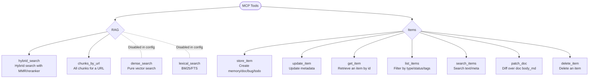

# Visual Summary Of MCP Tools

## Quick Notes

- `hybrid_search`: combines dense+lexical search, normalizes scores, applies MMR, and reranks when enabled.
- `chunks_by_url`: returns every chunk and metadata for a URL.
- `dense_search` / `lexical_search`: present but disabled in `config.yaml`; enable them with `mcp.tools` or tool sets.
- Scope: the RAG index is global (not per project); Items tools operate per project.
- `store_item`/`update_item`/`get_item`/`list_items`/`search_items`/`patch_doc`/`delete_item`: project-scoped item management (`project` or `project_id`). `typed` carries required per-type fields; `meta` is optional for extras. `patch_doc` edits docs by unified diff.

## Related UI Changes

- Dashboard -> Status: groups active tools by category and shows Memory counters for the active project.
- Dashboard -> Integrations: ready-to-copy snippets for Codex CLI, Claude Code, and GitHub Copilot (VS Code).
