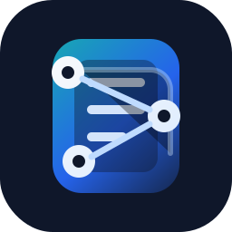

# Contextarium

<p align="center">
  
</p>

<p align="center">
  <strong>Local-first context, memory, and RAG tools for coding agents.</strong>
</p>

<p align="center">
  
  
  
  
  
</p>

Contextarium runs a local FastAPI web panel and an MCP-compatible HTTP endpoint that gives coding agents persistent project context. It combines:

- RAG over your selected documentation corpus.
- Project-scoped memory, docs, bugs, and todos.
- MCP tools for search and item management.
- A local control panel for ingestion, tool toggles, project selection, and operational status.

It is designed for trusted local development environments. Do not expose the UI or MCP endpoint to the public internet unless you add authentication and network controls.

## Table Of Contents

- [Why Contextarium](#why-contextarium)
- [Features](#features)
- [Architecture](#architecture)
- [Requirements](#requirements)
- [Quick Start](#quick-start)
- [Configuration](#configuration)
- [MCP Integrations](#mcp-integrations)
- [RAG Ingestion](#rag-ingestion)
- [Memory And Items](#memory-and-items)
- [Docker](#docker)
- [Security And Privacy](#security-and-privacy)
- [Development](#development)
- [Troubleshooting](#troubleshooting)
- [License](#license)

## Why Contextarium

Coding agents work better when they have stable, searchable project context. Contextarium provides that context locally without requiring a hosted service:

- Index project or product documentation into a DuckDB-backed vector store.
- Keep long-lived project memory in SQLite, separated from the RAG index.
- Expose selected capabilities through MCP so compatible clients can discover and call tools.
- Manage everything through a local web UI instead of hand-editing state.

## Features

- **Local control panel**: Dashboard, RAG, MCP Tools, Memory, Configuration, and Logs.
- **RAG search**: hybrid dense + lexical retrieval, MMR, optional reranking, and URL chunk reconstruction.
- **Project memory**: `memory`, `doc`, `bug`, and `todo` items with typed fields, metadata, statuses, and direct body editing in the UI.
- **MCP endpoint**: HTTP/JSON-RPC compatible `tools/list` and `tools/call` responses with structured output.
- **Tool controls**: enable or disable exposed tools from `config.yaml` or the web panel.
- **Two-database persistence**: DuckDB for global RAG, SQLite for project-scoped memory.
- **Docker support**: runtime image with persistent volumes for data, model cache, URL files, and config.

## Architecture

```text
MCP client / browser
        |
        v
FastAPI app (app.py)
        |
        +-- Web UI templates + static assets
        +-- MCP HTTP endpoint (/mcp)
        +-- RAG tools -> Retriever -> DuckDB (data/rag.duckdb)
        +-- Item tools -> ItemService -> SQLite (data/memory.sqlite3)
        +-- Rebuild pipeline -> Crawl4AI -> chunking -> embeddings -> DuckDB swap
```

The RAG index is global for the instance. Memory is project-scoped and uses the active project selected in the UI.

## Requirements

- Python 3.12.
- `pip`.
- Network access on first use if you need DuckDB extensions, local model downloads, or cloud providers.
- Optional cloud keys for cloud mode:
  - `OPENAI_API_KEY` for OpenAI embeddings.
  - `DEEPINFRA_API_KEY` if remote reranking is enabled.

Install runtime dependencies:

```bash
python -m pip install -r requirements.txt
```

For tests:

```bash
python -m pip install -r requirements-dev.txt
```

## Quick Start

```bash
cp .env.example .env
python app.py
```

Open the web panel:

```text
http://127.0.0.1:8000/
```

Default MCP endpoint:

```text
http://127.0.0.1:8000/mcp
```

From the UI:

- Create or select a project in Configuration.
- Ingest documentation from the RAG tab.
- Enable or disable MCP tools from MCP Tools.
- Copy integration snippets from Dashboard -> Integrations.

## Configuration

The app reads `config.yaml` by default. A clean starter copy is also provided as `config.example.yaml`.

Important paths:

```yaml
database:
  path: data/rag.duckdb

memory_database:
  path: data/memory.sqlite3
```

Runtime modes:

- `local`: uses local HuggingFace-compatible embedding/reranking models cached under `.cache/models`.
- `cloud`: uses OpenAI embeddings and optional DeepInfra reranking.

The default `config.yaml` does not select a project. Use the UI to create one, or set:

```yaml
ui:
  selected_project: my-project
```

## MCP Integrations

### Codex CLI

```toml
rmcp_client = true

[mcp_servers.contextarium_local]
url = "http://127.0.0.1:8000/mcp"
startup_timeout_sec = 2
tool_timeout_sec = 60
```

### Claude Code

```bash
claude mcp add --transport http contextarium http://127.0.0.1:8000/mcp
```

### GitHub Copilot In VS Code

Create `.vscode/mcp.json`:

```json
{
  "servers": {
    "contextarium": {
      "type": "http",
      "url": "http://127.0.0.1:8000/mcp"
    }
  }
}
```

## RAG Ingestion

Contextarium can rebuild the global RAG index from:

- A sitemap URL.
- A `.txt` file in `txt/` with one URL per line.

Rebuilds use a temporary DuckDB and atomically replace the previous index only after the pipeline succeeds. Existing projects and memory items are preserved because they live in SQLite.

Enabled search tools by default:

| Tool | Purpose |
| --- | --- |
| `hybrid_search` | Dense + lexical search with MMR and optional reranking. |
| `chunks_by_url` | Return every stored chunk for a URL. |

Optional tools:

| Tool | Purpose |
| --- | --- |
| `dense_search` | Pure vector search. |
| `lexical_search` | BM25/FTS search when the DuckDB extension is available. |

## Memory And Items

Items are stored per project in SQLite.

| Type | Use |
| --- | --- |
| `memory` | Decisions, invariants, architecture notes, and durable project context. |
| `doc` | Long-form Markdown docs edited through the UI or `patch_doc`. |
| `bug` | Reproducible incidents with severity, reproduction, expected behavior, and root cause. |
| `todo` | Actionable work with acceptance criteria, priority, dependencies, and resolution notes. |

Item MCP tools:

| Tool | Purpose |
| --- | --- |
| `store_item` | Create a project-scoped item. |
| `update_item` | Update title, tags, status, typed fields, or optional metadata. |
| `get_item` | Retrieve one item. |
| `list_items` | Filter by type, status, tags, and limit. |
| `search_items` | Search title, body, and metadata. |
| `patch_doc` | Apply a unified diff to a `doc` body. |
| `delete_item` | Delete an item. |

## Docker

Build and run:

```bash
docker build -t contextarium-tools .
docker run -p 8000:8000 \
  -v "$(pwd)/data:/app/data" \
  -v "$(pwd)/.cache:/app/.cache" \
  -v "$(pwd)/txt:/app/txt" \
  -v "$(pwd)/config.yaml:/app/config.yaml" \
  -e APP_HOST=0.0.0.0 \
  -e CONTAINER_NAME=contextarium-tools \
  --name contextarium-tools \
  contextarium-tools
```

With Docker Compose:

```bash
docker compose build
docker compose up
```

`config.yaml` must exist before `docker compose up` because Compose mounts it as a file. Copy `config.example.yaml` if needed.

Docker exposes port `8000`. Keep it bound to trusted networks unless you add authentication in front of it.

## Security And Privacy

Contextarium has no built-in authentication. Treat it as a local developer tool.

Do not publish or commit:

- `.env` files.
- `data/` databases.
- `.cache/` model caches.
- `.duckdb/` extension caches.
- `static/uploads/` attachments or screenshots.
- `*.log` files.

The mutable UI/API surface can rebuild indexes, edit memory, change tool settings, and restart the Docker container when configured. Put the app behind authentication and network restrictions before exposing it outside localhost or a trusted private network.

See `SECURITY.md` for reporting and deployment guidance.

## Development

Run the focused docs/publication tests:

```bash
python -m pytest test/test_docs_consistency.py test/test_branding_contextarium.py test/test_public_release_readiness.py
```

Run the full suite:

```bash
python -m pytest
```

Repository layout:

```text
app.py                 FastAPI app, UI API, startup wiring
mcp_server/            MCP HTTP/JSON-RPC server and tool schemas
utils/                 RAG, crawling, embeddings, item storage, config
templates/             Web UI templates
static/                CSS, JavaScript, logo, upload placeholder
Extra/Guias/           Maintainer guides
test/                  Pytest suite
txt/                   Optional URL lists for ingestion
```

## Troubleshooting

- **RAG tools report rebuild required**: create a fresh index from the RAG tab.
- **DuckDB extension warnings**: VSS/FTS extension loading may fail without network access. Search degrades instead of failing hard.
- **Torch/CUDA issues**: use a CPU-compatible Torch install or switch to cloud embedding mode.
- **Cloud mode fails**: check `.env` and make sure required API keys are available in the process environment.
- **Docker Compose creates a broken config mount**: ensure `config.yaml` exists before starting Compose.

## License

Contextarium is licensed under the Apache License 2.0. See `LICENSE`.
